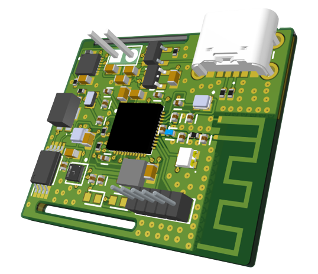
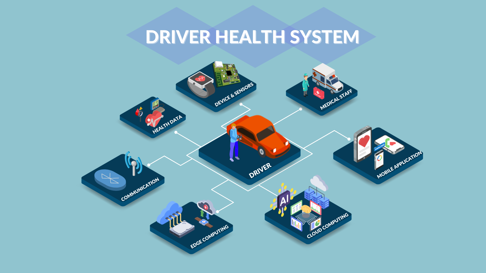

<!-- Template made by: https://github.com/othneildrew/Best-README-Template -->

  <h3>This project was developed by</h3>
  

    
    
    
  

<!-- PROJECT LOGO -->
 

  

  

    The DriveGuardian is an open-source project focused on the development of an Internet of Medical Things (IoMT) application. The system measures the health of drivers in their driving environment and provides crucial data to the user and the medical staff.
  

<!-- TABLE OF CONTENTS -->

  
Table of Contents

  <ol>
    <li><a href="#system-overview">System Overview</a></li>
    <li>
      <a href="#development">Development</a>
      <ul>
        <li><a href="#hardware">Hardware</a></li>
        <li><a href="#firmware">Firmware</a></li>
        <li><a href="#deep-learning-model">Deep Learning model</a></li>
        <li><a href="#mobile-application">Mobile application</a></li>
      </ul>
    </li>
    <li><a href="#results">Results</a></li>
    <li><a href="#acknowledgements">Acknowledgements</a></li>
    <li><a href="#license">License</a></li>
    <li><a href="#resources">Resources</a></li>
  </ol>

<!-- ABOUT THE PROJECT -->
## System Overview

  

The DriveGuardian integrates a variety of technologies that work side-by-side to achieve the highest performance. The goal is to measure and provide accurate data about the user's health condition. To do so, a **multi-function PCB** was designed that integrates a diversity of sensors as well as battery and memory management components. The electrical schematic and PCB were created using Altium Designer. Additionally, the device uses a **nRF52 chip** by Nordic Semiconductor to handle the communication with the sensors through I2C and Zephyr RTOS together with the wireless Bluetooth Low Energy settings. A **deep learning model** was built based on the [Deep PPG paper](https://www.mdpi.com/1424-8220/19/14/3079), the model integrates Convolutional Neural Network to estimate accurate and reliable heart rate measured by the photoplethysmogram (PPG) sensor. The DriveGuardian **mobile application** provides a friendly user-experience and displays relevant data for the user. Finally, a compact base prototype was printed to encapsulate the board and the battery, leaving enough space for the PPG sensor to function properly.

Some of the technologies/skills used for this project are listed below:
* Hardware: electronics/electrical engineering, wiring, CAD (Altium Designer) and soldering
* Firmware: C/C++, peripherals and communication protocols (I2C, GPIO),  Zephyr RTOS, nRF Connect SDK and wireless communication protocols (Bluetooth Low Energy)
* Machine learning: Python, data preparation tools (Pandas, NumPy, Matplotlib), cloud platform (to be implemented), TensorFlow and CNN
* Mobile application: Android, Kotlin, Jetpack compose, dependency injection, singleton, Firebase real-time database (to be implemented) and clean architecture
* General: Linux (Ubuntu), build systems (CMake), CI/CD (to be implemented) and version control (Git)

(<a href="#readme-top">back to top</a>)

## Development

### Hardware

An in-depth investigation was carried out to identify the optimal components for the application's wearable device. Parameters such as comfort, wearability, size, cost, and functionality were carefully considered in creating the Bill of Materials (BOM). The main components of the proposed BOM for the DriveGuardian project are:

| Component           | Model         |
| --------------------|:-------------:|
| MCU                 | nRF52832      |
| PPG                 | BH1790        |
| Accelerometer       | LIS2DW12      |
| Barometric pressure | BMP581        |
| EEPROM              |  AT24C512C    |
| BMS                 | MCP73831      |
| Fuel gauge          | MAX17260      |

The electrical schematic is divided into three sheets: 

  

Built around the foundation of the nRF52832 reference schematic design, which offered a structure for the integration of necessary and optional external passive components that ensure correct and reliable SoC functionality. The internal LDO setup configuration of the nRF52832 chip (based on Nordic’s reference schematic) was chosen for this design due to the input voltage supply being dropped to 3V. An additional external 32 kHz crystal was added for the Real-time clock (RTC) operation and BLE advertising. The antenna design was carefully examined with special consideration for the antenna specifications provided by Nordic.

  

The I2C communication protocol is used for all the sensors to communicate with the MCU. The LIS2DW12 has a full scale range of ±2g, ±4g, ±8g, or ±16g, and it offers a data output rate of up to 1600 Hz, which allows for high-resolution measurements of acceleration. The BMP581 sensor provides additional insights that can contribute to driver health assessment apart from its primary function in measuring atmospheric pressure.  The BH1790 optical sensor features a green LED emitter and a photodiode detector that work together to measure changes in blood volume in the capillaries. These changes in blood volume, known as PPG, are directly correlated with the heart rate. The AT24C512C EEPROM, a 512Kbit serial I2C EEPROM, serves as the ideal data storage solution.

  

The MCP73831 battery management system (BMS) is a safe and effective way to charge and safeguard the single-cell lithium-ion battery attached to the device. The device offers a dual power source option, allowing it to be powered either through a battery or a USB-C connection. The STLQ015 LDO is used to regulate the power supply for the microcontroller and other electronic components. The device also integrates the MAX17260 chip that functions as a fuel gauge and it is responsible to provide accurate and real-time information about the remaining capacity of the battery.

The PCB utilizes a 4-layer construction to optimize signal integrity and ensure reliable data transmission. The first and top layer is the signal layer and it primarily carries the electrical signals between various components on the PCB. For the second layer the PCB integrates the power layer, which is responsible for providing a dedicated path for delivering power to the device's components. The third layer represents the ground layer. The ground layer serves as a reference potential for all signals on the PCB, since it acts as a sink for electrical noise, preventing it from interfering with the sensitive signal paths. Finally, the last and bottom layer is the reference ground Layer and return path. The fourth layer, specifically designed for RF applications, serves as a reference ground plane for the RF circuitry and provides a return path for RF currents. This dedicated RF ground layer isolates the RF signals from the power and signal layers, minimizing noise coupling and ensuring optimal RF performance.

  
  

(<a href="#readme-top">back to top</a>)

### Firmware

The sensors drivers are still on test and debugging, since I don't currently have an oscilloscope. The driver setup was accomplished using nRF Connect SDK. The BLE connectivity is working fine with the smartphone. The source code is found at `Firmware/NRF52_firmware/` and the directory structure is automatically created by the SDK. It is as follows:

* boards
* build
* inc
* src
* CMakeLists.txt
* driverfit.overlay 
* prj.conf

(<a href="#readme-top">back to top</a>)

### Deep Learning model

The model was developed in an Anaconda environment using TensorFlow and python data processing libraries. The dataset used is for the model training and evaluation is the PPG-DaLiA that contains PPG, 3D-accelerometer, temperature and ECG data. The PPG and accelerometer channels are used for the input layer and the ECG heart rate datapoints serve as the ground truth. A record of 15 subjects performing a variety of activities were utilized. The model integrates a CNN architecture to enhance the heart rate measured by the PPG sensor and provide valid results. 

Data pre-processing methods were utilized to improve the model performance. Low pass filtering, Fast Fourier Transform and z-normalisation were conducted to clean the data and provide a structured matrix. 

  

The model will be applied to the DriveGuardian device and fitted into a driving environment case for better results.

(<a href="#readme-top">back to top</a>)

### Mobile application

  

The data is transmitted to the mobile application via BLE and the timely health data of the driver is easily accessible, enabling immediate intervention in case of critical health situations. The application offers a user-friendly interface with an intuitive design and user-experience. A LCD, which is a frequently used component in portable devices to display data in real-time, was evaluated for the user interface, but it is more favourable to use the mobile application as the main user-interface method due to energy-efficiency and practicability.

The Android application implements clean architecture, a MVVM approach and jetpack compose for the layout. It is planned to integrate Firebase to store the user's personal data (name, userid) and potential relevant information.

(<a href="#readme-top">back to top</a>)

## Results

The project is still under development, hence the results will be published soon.

(<a href="#readme-top">back to top</a>)

## Acknowledgements

<!-- UBI LOGO, IT LOGO, WAVES LOGO -->

(<a href="#readme-top">back to top</a>)

## License

Licensed under the MIT License, Copyright (c) 2024 jpbaiense

(<a href="#readme-top">back to top</a>)

## Resources

(<a href="#readme-top">back to top</a>)

<!-- MARKDOWN LINKS & IMAGES -->
<!-- https://www.markdownguide.org/basic-syntax/#reference-style-links -->
[profile-shield]: https://img.shields.io/badge/JOAO%20PEDRO%20BAIENSE-0761f0
[profile-url]: https://img.shields.io/badge/-LinkedIn-black.svg?style=for-the-badge&logo=linkedin&colorB=555
[email-shield]: https://img.shields.io/badge/Gmail-D14836?style=for-the-badge&logo=gmail&logoColor=white
[email-url]: silva.baiense@gmail.com
[linkedin-shield]: https://img.shields.io/badge/-LinkedIn-black.svg?style=for-the-badge&logo=linkedin&colorB=555
[linkedin-url]: https://linkedin.com/in/jpbaiense
[system-overview]: images/system_overview.png
[mcu-sheet]: images/mcu_sheet.png
[sensors-sheet]: images/sensors_sheet.png
[power-sheet]: images/power_sheet.png
[raw-matrix]: ML_architecture/notes/raw_matrix.png
[app-layout]: images/app_layout.png